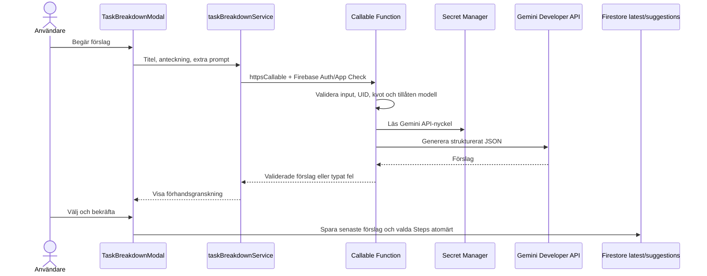

# Implementationsplan: Skifte av AI-implementation

## Syfte

Utvärdera och ersätta klientbaserade Gemini-anrop med ett serverlager, samtidigt som det godkända AI-flödet för uppgiftsnedbrytning, senaste förslagsuppsättningen och användarens val bevaras.

## Undersökningsresultat

- `src_foodhero/services/aiService.ts` använder `@google/generative-ai` direkt i webbläsaren. Den läser `VITE_GEMINI_KEY`/`VITE_GEMINI_API_KEY`, inkluderar nyckeln även i REST-anrop för modellistan och implementerar JSON-parsning, felmeddelanden, fallback och modellval.
- `src_looplist/services/aiService.ts` använder också `@google/generative-ai` direkt i webbläsaren med `VITE_GEMINI_KEY`. `AIListGeneratorModal.tsx` ger bra UX-inspiration: prompt, förhandsgranskning, generera om och spara först efter användarens val. `isAIGenerated` och `aiPrompt` är listmetadata, inte en alternativ serverarkitektur.
- Todo:s aktuella `src/services/taskBreakdownService.ts` använder Firebase AI Logic men innehåller nu även ett direkt REST-anrop med användarvald API-nyckel. `src/composables/useAiKeys.ts` sparar dessa nycklar i `localStorage`, och inställningar/modal läser och redigerar dem.
- Todo har redan Cloud Functions v2 i `functions/`, Node.js 24, region `europe-west1`, `maxInstances`-konfiguration, Auth, App Check-initiering och senaste AI-förslag i Firestore. Functions-kodbasen använder ännu ingen callable AI-funktion eller Gemini-SDK.
- `functions/package.json` är separat från webbappens beroenden. Servernyckeln ska därför aldrig vara en `VITE_*`-variabel eller ingå i en webbuild.

## Alternativ och rekommendation

| Alternativ | Fördelar | Nackdelar och risker | Bedömning |
| --- | --- | --- | --- |
| Firebase AI Logic från webbläsaren | Minst backendkod; Firebase hanterar AI-gateway och App Check; ingen Gemini-API-nyckel behöver ligga i klienten. | Klienten väljer och skickar prompt direkt; projektkvoter delas; svårare att lägga på serverstyrd policy och användarspecifik begränsning. | Fortsatt rimligt för enkel prototyp, men ger mindre central kontroll. |
| Direkt Gemini-anrop från webbläsaren | Enkel modell-API och lätt att prova olika modeller. | Delad `VITE_*`-nyckel blir publik. BYOK-nycklar i `localStorage` är åtkomliga för JavaScript i origin och användarens webbläsarprofil. Båda inspirationsprojekten har detta mönster; det bör inte kopieras till produktion. | Avråds för Todo. |
| Callable Cloud Function med Gemini Developer API | Nyckeln ligger i Secret Manager; servern kan kräva Auth och App Check, validera prompt/modell, begränsa anrop per användare, kontrollera fallback och returnera säkra fel. Webbappen kan behålla samma modala UX och Firestore-modell. | Mer kod och ytterligare nätverkshopp; kräver Secret Manager, Functions-deploy och Functions-kostnader/billing. | **Rekommenderas för skiftet**, eftersom projektet redan har en Functions-kodbas och kraven omfattar modellfallback och felkontroll. |

Firebase AI Logic är fortfarande ett giltigt alternativ och kan lämnas provisionerat under migreringen. Planen rekommenderar att själva inference-anropet flyttas till en callable Function, inte att de befintliga Firestore- och AI-förslagsmodellerna byggs om.

## Målarkitektur

- Webbappen anropar bara `httpsCallable`; den importerar inte `firebase/ai`, `@google/generative-ai` eller `@google/genai` och gör inga anrop till `generativelanguage.googleapis.com`.
- Callable-funktionen validerar Firebase Auth, `request.app`/App Check, titel/anteckning/prompt, modell-ID och maxantal innan den kontaktar Gemini.
- Gemini API-nyckeln hämtas från `defineSecret('GEMINI_API_KEY')` i Cloud Secret Manager. Endast den AI-callable funktionen binds till hemligheten.
- Functionen returnerar endast validerade steg och valt modell-ID. Klienten fortsätter hantera `aiBreakdowns/latest`, suggestion-status och `Step`-batchar via befintliga ägarregler.
- Användarens prompt, anteckning, API-nyckel och fullständiga Gemini-svar loggas inte. Funktionsloggar innehåller bara säkra fält som UID, modell-ID, felkategori, svarstid och request-id.

## Genomförande

### 1. Beslut och hemligheter

- [ ] Bekräfta att Gemini Developer API med en projektägd API-nyckel i Secret Manager är önskad backend-provider.
- [ ] Kontrollera att projektets billing-plan och IAM tillåter Cloud Functions, Secret Manager och Gemini Developer API.
- [ ] Skapa `GEMINI_API_KEY` med `firebase functions:secrets:set GEMINI_API_KEY`; håll värdet utanför `.env`, GitHub build-secrets och webappen.
- [ ] Bestäm hantering av befintliga BYOK-nycklar i `localStorage`. Rekommenderat standardval: sluta läsa/använda dem och rensa gamla `todo-gemini-api-keys` och `todo-gemini-selected-key` efter tydlig migreringsinformation.
- [ ] Kontrollera att App Check är enforced för Cloud Functions och att lokal utveckling/E2E använder registrerad debug-token utan att exponera den i repo.

### 2. Callable AI-funktion

- [ ] Lägg till `@google/genai` endast i `functions/package.json` och använd dess server-API från en ny modul, exempelvis `functions/src/taskBreakdown.ts`.
- [ ] Skapa `generateTaskBreakdown` med `onCall({ region: 'europe-west1', enforceAppCheck: true, secrets: [geminiApiKey] })`; kräv alltid `request.auth` och avvisa saknad Auth/App Check.
- [ ] Validera request-shape på servern: titel högst 200 tecken, anteckning högst 4000, extra prompt högst 1000, modell från allowlist och högst 20 delsteg.
- [ ] Skicka titel, eventuell anteckning och extra prompt som opålitlig användarkontext till modellen. Använd separat systeminstruktion och JSON-schema för `{ steps: string[] }`.
- [ ] Validera modellsvaret på servern: JSON/schema, högst 20 steg, trimma tomma titlar, max 180 tecken och deduplicera normaliserade titlar.
- [ ] Håll modell-ID:n centrala och serverkontrollerade: standard `gemini-3.8-flash`, alternativ `gemini-3.7-flash`, `gemini-3.6-flash`, `gemini-3.5-flash-lite`. Kontrollera status och projektåtkomst igen innan release; de första tre är dokumenterade som korttidsmodeller.
- [ ] Implementera en användar-/projektkvot före varje provider-anrop, exempelvis en transaktion i en separat `aiUsage`-path. Bestäm gräns, fönster, samtidighet och hur en misslyckad modellrequest debiteras.
- [ ] Begränsa Functionens `maxInstances`, timeout och minne. Lägg inte till en retry-loop som automatiskt spenderar flera modellrequest på användarens vägnar.

### 3. Fallback och säkra fel

- [ ] Anropa standardmodellen först. Vid uttryckligt modellkapacitetsfel returneras en `HttpsError` med säker `details.reason = 'model-overloaded'` och de tre tillåtna modellalternativen; klienten visar dropdown och användaren startar själv retry.
- [ ] Om användaren skickar ett alternativ vid retry kontrollerar Functionen modell-ID:t mot samma allowlist innan anrop.
- [ ] Skilj modellöverbelastning från projekt-/providerkvot, billing, invalid input, Auth, App Check, nätverksfel, konfigurationsfel och ogiltigt svar. Visa alternativa modeller endast för modellkapacitetsfel.
- [ ] Mappa fel till generiska svenska meddelanden. Lägg aldrig providerfel, stack traces, nycklar, råa promptar eller anteckningar i callable-svaret eller loggar.
- [ ] Testa hur Functions SDK:s `HttpsError.code` och `details` mappas till befintlig `TaskBreakdownError` i webappen.

### 4. Klientmigration

- [ ] Ersätt Firebase AI Logic och browser-REST-grenen i `src/services/taskBreakdownService.ts` med en typed `httpsCallable`-wrapper riktad mot `europe-west1`.
- [ ] Ta bort `apiKey` från `TaskBreakdownInput` och ta bort `readAiKeys()` från genereringsflödet.
- [ ] Ta bort `src/composables/useAiKeys.ts`, dess `localStorage`-nyckelhantering, inställningssektionen för Gemini API-nycklar och nyckelinmatningen i AI-modalen; uppdatera tester som förutsätter BYOK.
- [ ] Behåll de tre modellerna i reserv-dropdownen, men låt inte klienten anropa modellen direkt eller välja modell-ID utanför allowlisten.
- [ ] Bevara modalens kontextvisning, extra prompt, preview, val/avval, senaste förslagsuppsättning, felpresentation och befintliga Firestore-batch för valda delsteg.
- [ ] Behåll en stabil client-service-kontraktstyp så UI inte blir beroende av Firebase callable response envelope.

### 5. Tester och emulatorer

- [ ] Unit-tester för serverns inputvalidering, allowlist, JSON-resultat, maxgränser, deduplicering, auth/appCheck-avslag, användarkvot och varje felkategori.
- [ ] Provider-tester med injicerad/mockad Gemini-klient; inga externa Gemini-anrop eller verkliga Secret Manager-hemligheter i CI.
- [ ] Callable-emulator-/integrationstester för Auth och App Check-krav samt säkert `HttpsError.details`-kontrakt.
- [ ] Uppdatera `src/__tests__/taskBreakdownService.spec.ts` till att mocka `httpsCallable` i stället för Firebase AI Logic/fetch och ta bort tester som skickar nycklar från klienten.
- [ ] Uppdatera `e2e/tasks.spec.ts` att mocka callable-endpointen och täcka defaultanrop, val av alternativ vid modellöverbelastning, quota/App Check-fel utan dropdown, bekräftelse/återöppning och att generering inte skriver delsteg.
- [ ] Kör befintliga Firestore Rules Emulator-tester för `latest/suggestions` och `Step`-batchar; håll AI-generering och secrets mockade.

### 6. Stegvis utrullning och avveckling

- [ ] Implementera Functionen och klient-wrappen medan Firebase AI Logic-koden ännu finns kvar, men aktivera nya callable-flödet för ett begränsat testläge först.
- [ ] Verifiera Auth, App Check enforcement, Secret Manager-bindning, kvotgräns, fallback-dropdown och redigerbar latest-förslagsuppsättning i staging.
- [ ] Växla alla genereringar till callable-funktionen; blockera klientens direkta Gemini-anrop.
- [ ] Rensa tidigare BYOK-nycklar efter migreringsinformationen och verifiera att ingen `VITE_GEMINI_KEY`, `VITE_GEMINI_API_KEY` eller `apiKey` finns i production bundle eller nätverksrequest från webben.
- [ ] Behåll Firebase AI Logic provisionerat tills sökningar och telemetri visar att ingen klient längre använder det; avveckla först därefter om projektet inte har andra AI Logic-konsumenter.
- [ ] Höj paketversion enligt repoets SemVer-regel när implementationen är validerad, före eventuell commit.

## Risker och avgränsningar

| Risk | Hantering |
| --- | --- |
| API-nyckel läcker via frontend bundle eller browser storage | Endast Secret Manager för servernyckeln; inga `VITE_*`-nycklar eller BYOK-värden i webben. |
| Otillåtna callable-anrop ger modellkostnad | Auth, App Check enforcement, servervalidering, per-user-kvot, max-instansbegränsning och kostnadsmonitorering. |
| 429 kan betyda kvot eller kapacitet | Klassificera felmeddelande/providerfel på servern; dropdown endast för kapacitetsfel. |
| Funktionsregion ökar svarstid | Behåll `europe-west1`, klientens Functions-instans och Auth-/Firestore-region där möjligt; mät verklig latens. |
| Omgenerering eller retry skriver över förslag | Ersätt latest endast när en ny request lyckats och validerats; behåll tidigare latest vid fel. |
| BYOK-nycklar raderas utan användarens vetskap | Visa tydlig migreringsinformation och avgör uttryckligen om projektet ska sluta stödja BYOK före utrullning. |
| Två AI-implementationer kör parallellt | Feature flag/staging, mätning av callable-fel och tydlig rollback innan gamla klientvägen tas bort. |

## Öppna frågor

1. Ska BYOK-stöd helt tas bort? Rekommendationen är ja: Todo använder projektets skyddade API-nyckel, medan en användares personliga Gemini-nyckel inte lagras eller skickas från webbläsaren.
2. Är Gemini Developer API med Secret Manager rätt provider, eller behöver ni Vertex AI/Agent Platform av policy-, regions- eller avtalskrav?
3. Vilken initial användargräns för AI-generering är rimlig, exempelvis ett bestämt antal anrop per användare per tidsfönster?
4. Ska Firebase AI Logic fortsätta vara aktiverat under och efter övergången, ifall andra funktioner använder det?
