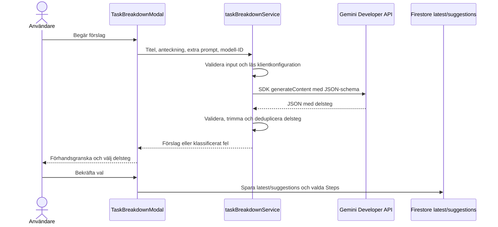

# Implementationsplan: Gemini-klient enligt Foodhero-mönstret

## Syfte

Ändra Todo:s uppgiftsnedbrytning så att Gemini-anrop, modellval och kapacitetsfallback fungerar på samma sätt som i `src_foodhero/services/aiService.ts`. Behåll Todo:s befintliga gränssnitt för förhandsgranskning, val av delsteg och sparande i Firestore.

## Målbild från Foodhero

- Använd `@google/generative-ai` direkt från webbklienten. Ingen callable Cloud Function används för generering.
- Skapa SDK-klienten från `VITE_GEMINI_KEY`, med `VITE_GEMINI_API_KEY` som kompatibel reservvariabel.
- Låt användaren välja modell. Spara modell-ID i `localStorage`; använd `VITE_GEMINI_MODEL` och därefter en standardmodell om inget sparat val finns.
- Hämta modeller som stöder `generateContent` från Gemini Models REST API. Filtrera bort irrelevanta modeller, sortera användbara alternativ och cacha listan i `localStorage` med en tidsbegränsad cache.
- Anropa den valda modellen först. Vid ett klassificerat kapacitetsfel gör klienten ett nytt försök med en fast fallbackmodell, på samma sätt som Foodhero. Andra fel ska inte utlösa modellfallback.
- Be Gemini returnera JSON och validera/parsa svaret i klienttjänsten innan det skickas vidare till Todo-gränssnittet.

## Säkerhetsbeslut

> Den här arkitekturen innebär avsiktligt att Gemini API-nyckeln är publik: `VITE_*`-värden byggs in i JavaScript och Gemini-anrop görs från användarens webbläsare. Det är samma modell som Foodhero, men nyckeln är inte en serverhemlighet och får inte ges skyddsvärde.

- [ ] Produktägaren bekräftar att en gemensam projektägd Gemini-nyckel i webbläsaren är acceptabel, inklusive risken för missbruk och oväntade kostnader.
- [ ] Begränsa nyckeln hos Google till nödvändiga API:er och webb-origin/referrers där det stöds; sätt kvoter, kostnadsaviseringar och rutin för nyckelrotation.
- [ ] Använd aldrig denna nyckel för privilegierad åtkomst eller skicka hemlig/personlig information i promptar. Firebase App Check skyddar inte direkta Gemini-anrop från webbläsaren.
- [ ] Använd en separat utvecklingsnyckel och CI/E2E-mocks. Äkta nycklar får inte hamna i Git, tester, loggar eller screenshots.

## Målarkitektur

- Lägg `@google/generative-ai` i webbappens beroenden, inte i `functions/`. `taskBreakdownService` äger SDK-initiering, modellkatalog, cache, felklassificering och validering.
- Ta bort Firebase AI Logic och direkt REST-generering med användarens BYOK-nyckel från genereringsflödet. Modellen väljs i Todo-gränssnittet, men API-nycklar hanteras inte av användaren.
- Behåll den befintliga Todo-kontrakttypen: tjänsten returnerar `{ modelId, steps }`; UI ska inte känna till SDK:ns response-objekt.
- Endast en lyckad och validerad generering får ersätta senaste förslagsuppsättningen. Bekräftelse och Firestore-skrivningar fortsätter följa befintliga ägarregler och atomiska batchar.

## Genomförande

### 1. Klientkonfiguration och modeller

- [x] Lägg till `@google/generative-ai` som beroende för webbappen och initiera SDK:t från `VITE_GEMINI_KEY || VITE_GEMINI_API_KEY`.
- [x] Läs standardmodell från `VITE_GEMINI_MODEL`; tillåt användarens modellval att sparas i en egen, versionsstabil `localStorage`-nyckel.
- [x] Implementera dynamisk hämtning av modeller som stöder `generateContent`, med filtrering, visningsmetadata, sortering och fallback till en statisk modellista när nyckel/nätverk/API inte är tillgängligt.
- [x] Cacha modellistan lokalt med TTL och stöd för tvingad uppdatering. Hantera trasig/otillgänglig `localStorage` utan att AI-flödet kraschar.
- [x] Bekräfta modellernas tillgänglighet och välj stabila standard-/fallback-ID:n före release. Hårdkoda inte tillfälliga modell-ID:n utan verifiering.
- [x] Ta bort nyckelhantering från `useAiKeys`, inställningar och AI-modal; rensa tidigare Todo BYOK-poster efter att migrationsbeteendet är beslutat och testat.

### 2. Generering och svar

- [x] Ersätt `firebase/ai`, `GoogleAIBackend` och `generateWithApiKey` REST-flödet i `src/services/taskBreakdownService.ts` med `GoogleGenerativeAI` och `getGenerativeModel`.
- [x] Behåll lokal validering: titel högst 200 tecken, anteckning högst 4000, extra prompt högst 1000, högst 20 delsteg och högst 180 tecken per delsteg.
- [x] Skicka titel, anteckning och extra prompt som användarkontext med en separat svensk systeminstruktion. Begär `{ steps: string[] }` med JSON-mime type/schema och lämplig output-token-gräns.
- [x] Validera SDK-svaret även när response schema används: reservera tillräcklig outputbudget, upptäck `MAX_TOKENS` innan JSON-parsning, kontrollera strukturen, trimma och ta bort tomma/för långa värden, deduplicera delsteg och avvisa tomt resultat.
- [x] Returnera bara normaliserade delsteg och det modell-ID som faktiskt användes. Lägg aldrig rått providerfel, prompt eller API-nyckel i användarvända felmeddelanden/loggar.

### 3. Fallback och fel

- [x] Implementera Foodhero-lik klassificering av kapacitetsfel, exempelvis 503, high demand, capacity och overloaded; var försiktig med 429 eftersom det även kan betyda projektkvot/billing.
- [x] Vid kapacitetsfel på vald modell, försök en gång med en separat fast fallbackmodell. Ingen retry-loop och ingen automatisk kedja av flera modeller.
- [x] Behåll modellväljaren så användaren kan välja ett annat tillgängligt alternativ. Visa fallback/modellförslag endast när felet rimligen beror på modellkapacitet; kvot, billing, nätverk, konfiguration och ogiltigt svar ska få separata feltyper.
- [x] Om fallback också misslyckas, mappa felet till ett kort svenskt meddelande utan att exponera Gemini:s råa svar eller nyckel.

### 4. UI och befintligt Todo-flöde

- [x] Uppdatera modellväljaren i AI-modal/inställningar för dynamisk modellista, laddnings-/offline-/tomt tillstånd och valt modell-ID.
- [x] Behåll kontextvisning, extra prompt, preview, välja/avvälja, generera om, latest-förslag, felpresentation och bekräftelse innan delsteg skrivs.
- [x] Behåll befintligt Firestore-format och batch för `aiBreakdowns/latest`, suggestion-status och valda `Step`-dokument; en generering ensam får inte skriva delsteg.
- [x] Ta bort API-nyckelinmatning och val av sparad användarnyckel. Låt inga API-nycklar passera genom `TaskBreakdownInput` eller Pinia-store.

### 5. Tester och validering

- [x] Uppdatera `src/__tests__/taskBreakdownService.spec.ts` för att mocka `@google/generative-ai`; täck prompt, modellval, JSON-validering, ogiltigt/tomt svar, gränser och felklassificering.
- [x] Testa fallback: vald modell lyckas utan retry; kapacitetsfel provar fallback exakt en gång; kvot-, konfigurations- och nätverksfel provar inte fallback.
- [x] Uppdatera tester för `useAiKeys`, inställningar och AI-modal när BYOK tas bort; lägg till täckning för modellval och modellcache.
- [x] Uppdatera `e2e/tasks.spec.ts` att mocka SDK-/Gemini-anrop deterministiskt och verifiera modellöverbelastning, användarens omförsök/modellval, bekräftelse/återöppning och att generering inte skriver delsteg.
- [x] Uppdatera `e2e/settings.spec.ts` att verifiera dynamiskt modellval och persistens utan API-nyckelinmatning.
- [ ] Kör Firestore Rules Emulator-tester för `latest/suggestions` och `Step`-batchar; inga riktiga Gemini-anrop eller produktionsnycklar i CI/E2E.
- [x] Kör obligatoriskt `npm run type-check && npm run lint`, relevanta Vitest/E2E-tester och därefter `npm run validate` när miljön stöder det.

### 6. Utrullning

- [ ] Lägg in miljövariabeln för Vite i lokal utveckling och deployment-miljöer utan att committa värdet. Verifiera att appen ger ett tydligt konfigurationsfel om nyckeln saknas.
- [ ] Testa i staging med en begränsad Gemini-nyckel: modellistan, cache, valt modell-ID, normal generering, kapacitetsfallback, felmeddelanden och Firestore-bekräftelse.
- [ ] Bygg och granska webbpaketet samt nätverksanropen: förvänta dig att klientnyckeln är synlig och säkerställ att inga andra credentials eller råa promptar läcker.
- [ ] Ta bort oanvänd Firebase AI Logic-konfiguration först efter att Todo:s klient inte längre använder den och efter kontroll av eventuella andra konsumenter.
- [x] Ta bort oanvända Functions-/Secret Manager-plansteg; någon Gemini callable-funktion eller serverhemlighet ingår inte i denna målarkitektur.

## Risker och avgränsningar

| Risk | Hantering |
| --- | --- |
| Klientnyckeln kan extraheras ur webbuild och användas utanför appen | Acceptera uttryckligen risken, begränsa nyckel/API/origins, sätt kvoter och kostnadsaviseringar, rotera vid missbruk. Det finns ingen serverbaserad per-user-kvot i denna arkitektur. |
| Direkt Gemini-anrop kan ge oväntad kostnad eller kvotförbrukning | Använd projektkvoter och monitorering; fallback gör högst ett extra anrop och endast vid kapacitetsfel. |
| Gemini-modellistan ändras eller innehåller olämpliga modeller | Filtrera efter `generateContent`, exkludera oönskade modelldelar, ha statisk fallback och verifiera standard-/fallbackmodell vid release. |
| HTTP 429 kan betyda modellkapacitet eller projektkvot | Klassificera status tillsammans med providerfel; visa inte modellfallback när kvot/billing sannolikt är orsaken. |
| Klientens modellcache eller lagring är trasig | Validera cacheformat/TTL och fall tillbaka till statiska modeller när cache eller `localStorage` inte går att använda. |
| Svar kan vara ogiltigt trots JSON-schema | Validera och normalisera alltid svaret före preview eller Firestore-skrivning; behåll latest vid genereringsfel. |
| BYOK-data finns kvar efter migrering | Sluta läsa/skriva Todo:s gamla BYOK-nycklar och rensa lagringen enligt beslutad migrationshantering. |

## Beslut

1. Målprovider är Gemini Developer API från webbklienten via `@google/generative-ai`, enligt `src_foodhero/services/aiService.ts`.
2. En gemensam `VITE_GEMINI_KEY`/`VITE_GEMINI_API_KEY` används; användarstyrda BYOK-nycklar tas bort.
3. Modellval och modellistan följer Foodhero-mönstret: dynamisk upptäckt/cache, lokalt sparat val och en fast fallback endast vid kapacitetsfel.
4. Den publika klientnyckeln och avsaknaden av serverbaserad användarkvot är accepterade avgränsningar som måste vägas mot användningsfall, API-restriktioner och kostnadsgränser före release.
